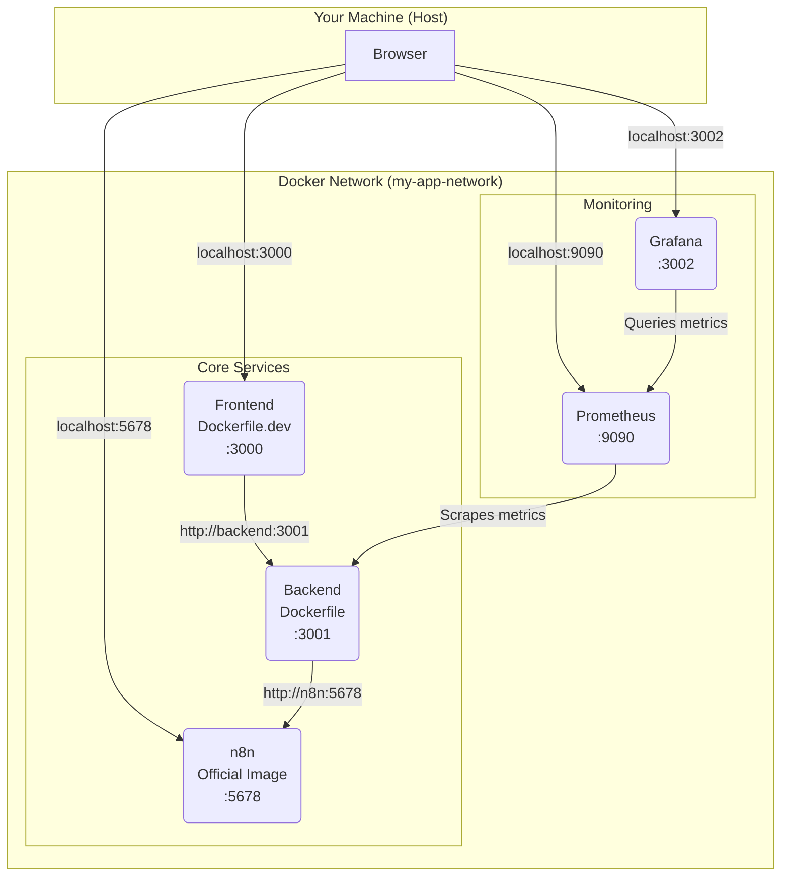

# Docker Setup Guide

This document provides an overview of the Docker configuration for the SocialDev project, covering Dockerfiles and Docker Compose for local development and production-like environments.

## Overview

Docker is used to containerize each service (frontend, backend, n8n, etc.), ensuring a consistent and reproducible environment for development and deployment.

## Dockerfiles

The project uses different Dockerfiles for development and production to optimize for build speed, image size, and hot-reloading.

### Backend (`backend/Dockerfile`)

This is a multi-stage Dockerfile designed for production:
-   **`builder` stage**: Installs npm dependencies and copies the source code.
-   **`production` stage**: Copies the installed `node_modules` and source code from the `builder` into a clean `node:18-alpine` image. This results in a smaller and more secure final image.

### Frontend (`frontend/Dockerfile` and `frontend/Dockerfile.dev`)

-   **`frontend/Dockerfile` (Production)**: A multi-stage build for Next.js.
    -   **`deps` stage**: Installs npm dependencies.
    -   **`builder` stage**: Builds the Next.js application (`npm run build`).
    -   **`runner` stage**: Copies only the necessary build artifacts (`.next/standalone`, `.next/static`, `public`) into a minimal `node:18-alpine` image for a small production footprint. It runs as a non-root `nextjs` user for improved security.

-   **`frontend/Dockerfile.dev` (Development)**: A simpler, single-stage Dockerfile that installs all dependencies and runs the application with `npm run dev` to enable hot-reloading.

## Docker Compose

The project includes multiple `docker-compose` files for different use cases.

-   **`docker-compose.yml`**: The main file for a complete local development environment. It includes the frontend, backend, n8n, Prometheus, and Grafana.
-   **`docker-compose.dev.yml`**: A smaller setup for core application development, including only the frontend, backend, and n8n.
-   **`docker-compose.prod.yml`**: Simulates a production environment by using the production Dockerfiles. It does not include development or monitoring tools.

### Running the Local Development Environment

To start all services for local development, including monitoring:
```sh
docker-compose up -d
```
The services will be available at:
-   **Frontend**: [http://localhost:3000](http://localhost:3000)
-   **Backend**: [http://localhost:3001](http://localhost:3001)
-   **n8n**: [http://localhost:5678](http://localhost:5678)
-   **Prometheus**: [http://localhost:9090](http://localhost:9090)
-   **Grafana**: [http://localhost:3002](http://localhost:3002)

### Architecture Diagram (Local Development)

The following diagram shows how the services in `docker-compose.yml` interact.


