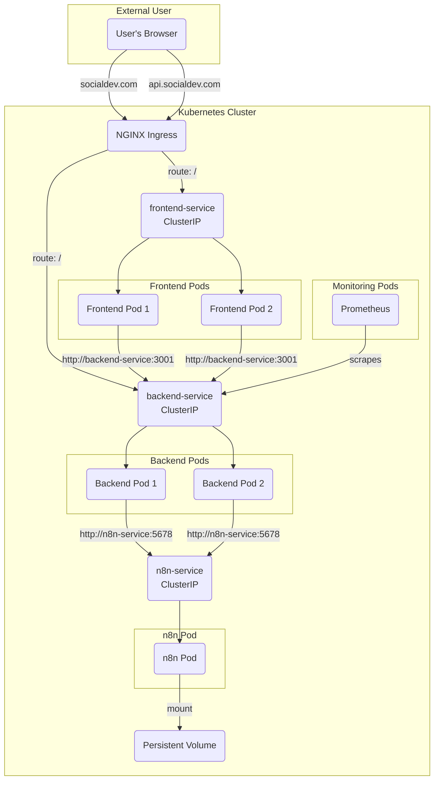

# Kubernetes Setup Guide

This document explains the Kubernetes configuration for deploying the SocialDev application stack.

## Overview

Kubernetes is used to orchestrate the containerized services in a production-like environment. It handles service discovery, scaling, and routing of traffic.

## Directory Structure

All Kubernetes manifests are located in the `k8s/` directory.
-   **`k8s/`**: Contains the concrete YAML manifests for deploying services, configuring storage, and setting up monitoring.
-   **`k8s/Templates/`**: Contains template files for generating manifests. These templates use placeholders like `${DOMAIN}` that can be substituted with environment-specific values.

## Core Components

The application is broken down into several Kubernetes resources:

### 1. Deployments

-   **`frontend-deployment.yaml`**: Manages the pods for the frontend application. It is configured to run 2 replicas for high availability.
-   **`backend-deployment.yaml`**: Manages the pods for the backend service, also running 2 replicas.
-   **`n8n-deployment.yaml`**: Manages the pod for the n8n workflow automation engine.

### 2. Services

Services provide stable network endpoints to access the pods.
-   **`frontend-service`**: A `ClusterIP` service that exposes the frontend pods on port 80 within the cluster.
-   **`backend-service`**: A `ClusterIP` service that exposes the backend pods on port 3001. It includes a named port `http-metrics` so that Prometheus can discover and scrape metrics.
-   **`n8n-service`**: A `ClusterIP` service that exposes the n8n pod on port 5678.

### 3. Ingress

-   **`ingress.yaml`**: This manifest defines the routing rules for external traffic. It uses an NGINX Ingress Controller to direct requests to the appropriate service based on the requested hostname.
    -   `socialdev.com` -> `frontend-service`
    -   `api.socialdev.com` -> `backend-service`
    -   `n8n.socialdev.com` -> `n8n-service`
    -   `prometheus.socialdev.com` -> Prometheus service
    -   `grafana.socialdev.com` -> Grafana service

### 4. Storage

-   **`n8n-pv.yaml` & `n8n-pvc.yaml`**: A `PersistentVolume` and `PersistentVolumeClaim` are used to provide stable storage for the n8n service. This ensures that n8n workflows and data persist across pod restarts. In this configuration, it uses a `hostPath`, which is suitable for a single-node cluster but should be replaced with a shared storage solution (like an EFS provisioner) for multi-node clusters.

### 5. Monitoring

-   **`backend-servicemonitor.yaml`**: A `ServiceMonitor` Custom Resource that tells the `kube-prometheus-stack` to automatically discover and scrape metrics from the `backend-service`.
-   **`grafana-dashboard-cm.yaml`**: A `ConfigMap` that holds the JSON definition for a Grafana dashboard. The Grafana instance deployed by `kube-prometheus-stack` is configured to automatically discover and load dashboards from such ConfigMaps.

## Architecture Diagram (Kubernetes)

This diagram shows how external traffic flows through the Ingress to reach the different services, and how services communicate internally.

