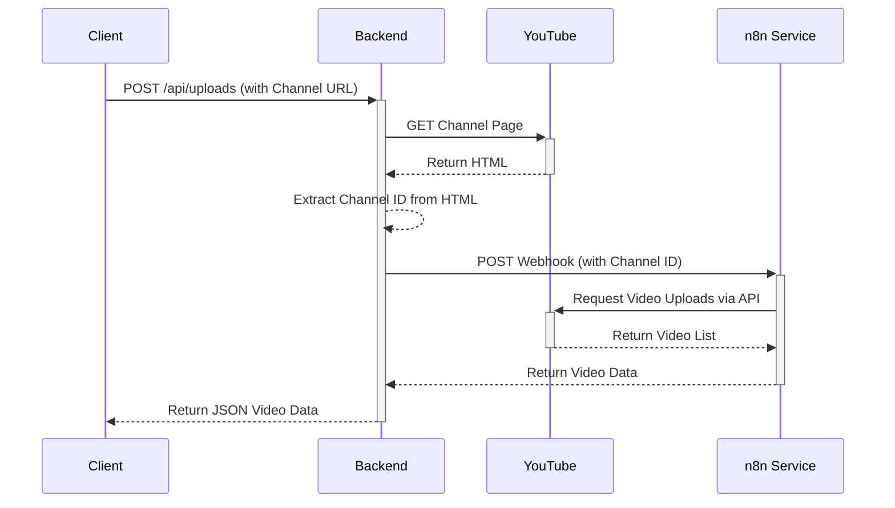

# Backend API Documentation
<!--
  Note: This Markdown file serves as a temporary API documentation due to simplicity and to meet deadlines.
  A more comprehensive Swagger/OpenAPI specification would typically be used for production APIs.
-->

This document provides details about the API endpoints available in the backend service. The backend is a Node.js Express application responsible for fetching data from external services and exposing metrics.

## Endpoints

### 1. Get YouTube Channel Uploads

Fetches a list of recent video uploads for a given YouTube channel. This endpoint acts as a proxy to an n8n workflow, which handles the actual interaction with the YouTube API.

- **URL**: `/api/uploads`
- **Method**: `POST`
- **Headers**: `Content-Type: application/json`

#### Request Body

The request body must be a JSON object containing the `channelId`.

| Field       | Type   | Required | Description                                                                                                                              |
| ----------- | ------ | -------- | ---------------------------------------------------------------------------------------------------------------------------------------- |
| `channelId` | string | Yes      | The identifier for the YouTube channel. This can be either the direct Channel ID (e.g., `UC-lHJZR3Gqxm24_Vd_AJ5Yw`) or a full channel URL (e.g., `https://www.youtube.com/channel/UC-lHJZR3Gqxm24_Vd_AJ5Yw`). |

**Example Request:**

```json
{
  "channelId": "https://www.youtube.com/channel/UC-lHJZR3Gqxm24_Vd_AJ5Yw"
}
```

#### Responses

- **`200 OK`**: Success
  - Returns a JSON array of video objects fetched from the n8n service.
  - **Note**: In some error cases (like a generic error from n8n or an empty response), the API will return a `200 OK` with an empty array `[]` to prevent the client application from breaking.

  **Example Success Response:**

  ```json
  [
    {
      "videoId": "video_id_1",
      "title": "My First Video",
      "thumbnailUrl": "https://example.com/thumb1.jpg"
    },
    {
      "videoId": "video_id_2",
      "title": "Another Great Video",
      "thumbnailUrl": "https://example.com/thumb2.jpg"
    }
  ]
  ```

- **`400 Bad Request`**: Client Error
  - Returned if the `channelId` field is missing from the request body.
    ```json
    {
      "error": "channelId (URL or ID) is required"
    }
    ```
  - Returned if a URL is provided but the channel ID cannot be extracted from it. This can happen if the URL is invalid or the page structure has changed, breaking the scraping logic.
    ```json
    {
      "error": "Invalid or unsupported YouTube channel URL. Could not extract channel ID."
    }
    ```

- **`503 Service Unavailable`**: Server Error
  - Returned if the backend cannot connect to the n8n service.
    ```json
    {
      "error": "Cannot connect to the n8n service. Please ensure it is running."
    }
    ```

- **`504 Gateway Timeout`**: Server Error
  - Returned if the n8n service takes too long (more than 90 seconds) to respond.
    ```json
    {
      "error": "The n8n service took too long to respond. Please try again later."
    }
    ```

### 2. Expose Application Metrics

Exposes application performance and custom metrics in a format that can be scraped by a Prometheus server.

- **URL**: `/metrics`
- **Method**: `GET`

#### Responses

- **`200 OK`**: Success
  - Returns a `text/plain` response containing the metrics.

  **Example Response:**
  ```text
  # HELP http_requests_total Total number of HTTP requests
  # TYPE http_requests_total counter
  http_requests_total{method="POST",route="/api/uploads",status_code="200"} 15
  http_requests_total{method="GET",route="/metrics",status_code="200"} 5

  # HELP http_request_duration_seconds Duration of HTTP requests in seconds
  # TYPE http_request_duration_seconds histogram
  http_request_duration_seconds_bucket{le="0.1",method="POST",route="/api/uploads",status_code="200"} 10
  # ... other histogram data
  ```

## Internal Logic Notes

### Channel ID Extraction

- When a URL is passed to the `/api/uploads` endpoint, the backend attempts to scrape the HTML of the YouTube channel page.
- It uses the regular expression `/"browseId":"(UC[\w-]{22,})"/` to find the channel ID.
- **This method is fragile.** If YouTube changes its page source, this extraction will fail. For maximum reliability, it is recommended to provide the direct channel ID whenever possible.

## API Flow (Mermaid)

The following diagram illustrates the sequence of events for a typical `/api/uploads` request.


